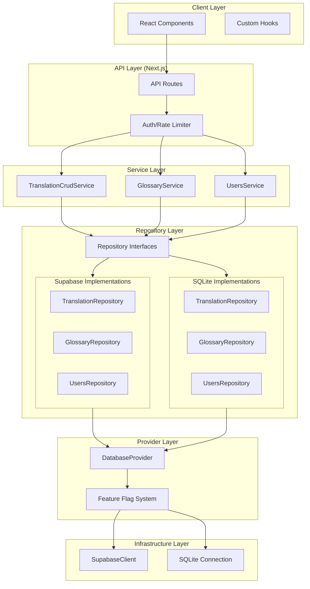
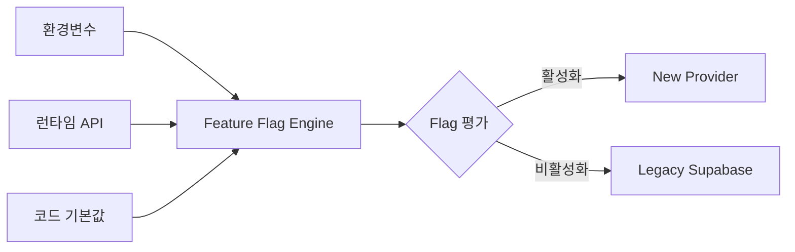
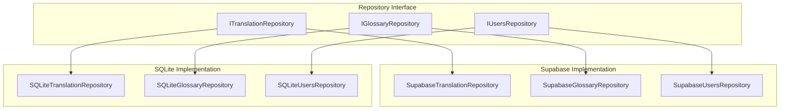
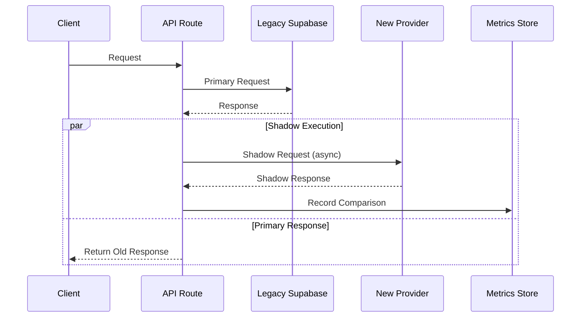
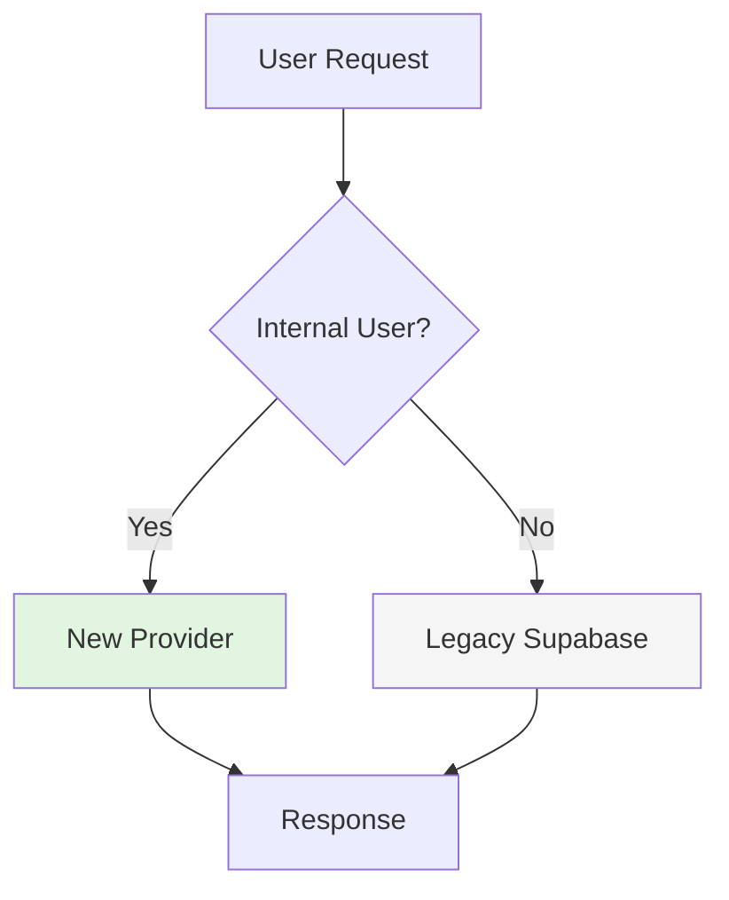
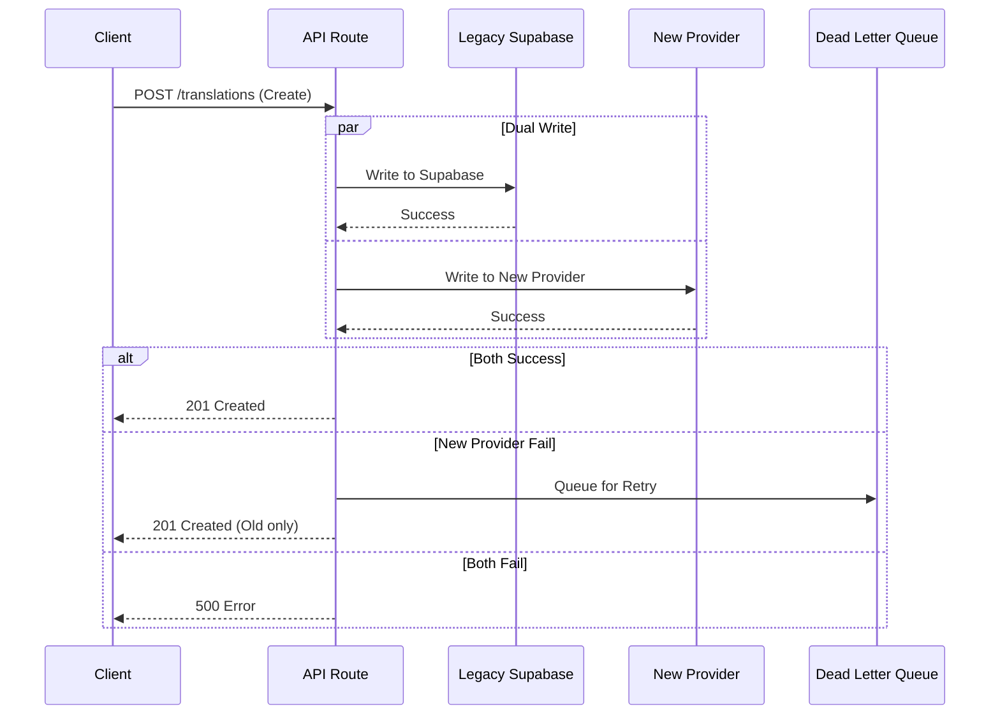
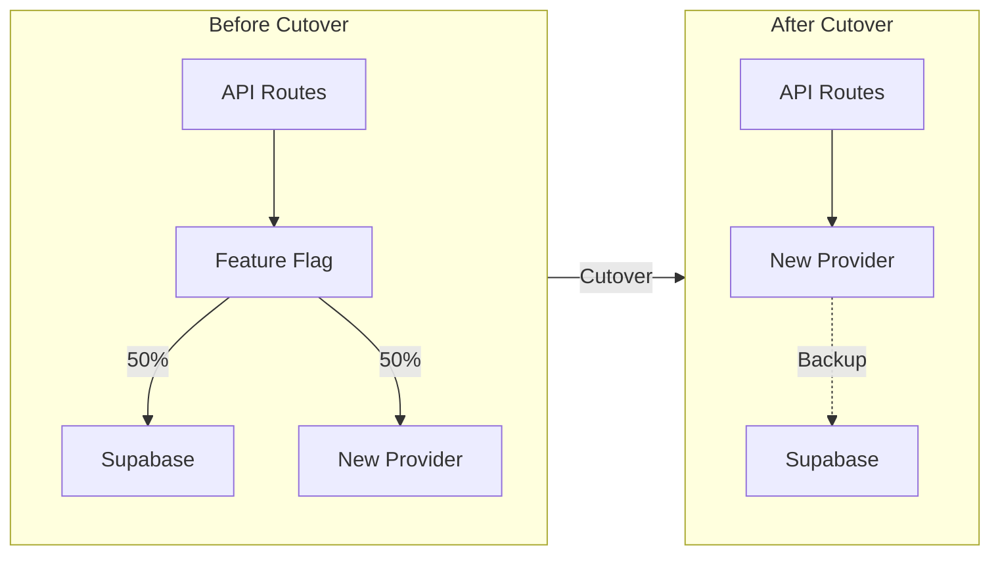
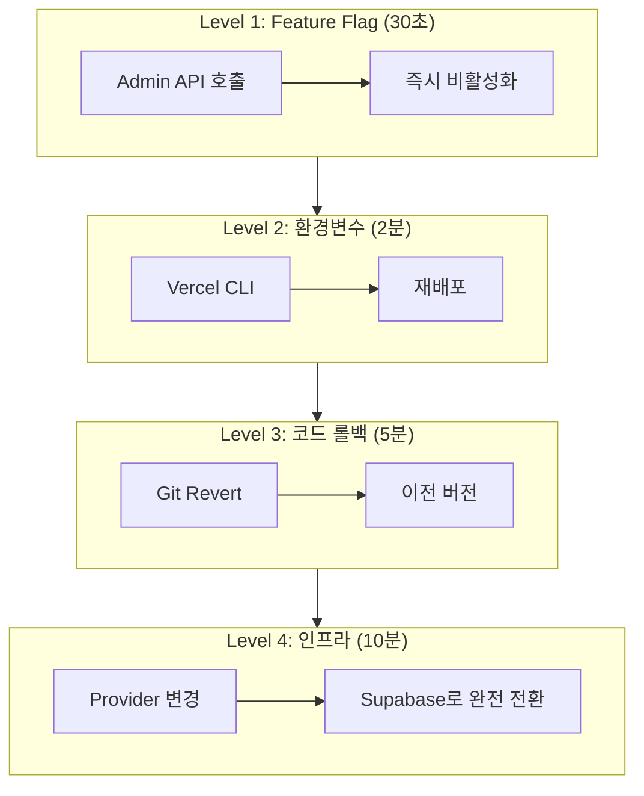

# Pilot Migration Guide

> Supabase → Provider 패턴 마이그레이션 완벽 가이드

---

## 개요

| 항목 | 내용 |
|------|------|
| **Project** | translation-manager |
| **목적** | Supabase 직접 의존 → Provider 패턴으로 마이그레이션 |
| **기간** | 2026-03-15 ~ 현재 |
| **목표** | Zero-downtime, Rollback 가능, 점진적 적용 |

### 마이그레이션 배경

```
[Before]                    [After]
┌─────────────┐            ┌─────────────┐     ┌─────────────┐
│   Service   │──┐         │   Service   │────→│  Repository │
│    Layer    │  │         │    Layer    │     │   (Interface)│
└─────────────┘  │         └─────────────┘     └──────┬──────┘
                 │                                    │
┌─────────────┐  │         ┌─────────────┐     ┌──────┴──────┐
│ Repository  │←─┘         │   Provider  │←────│  Supabase   │
│   (Direct)  │            │   Pattern   │     │   Client    │
└──────┬──────┘            └──────┬──────┘     └─────────────┘
       │                          │
       ▼                          ▼
┌─────────────┐            ┌─────────────┐
│  Supabase   │            │   SQLite    │  ← 테스트/로컬
│  (강결합)    │            │  (In-Memory)│
└─────────────┘            └─────────────┘
```

**주요 개선 효과:**
- 테스트 속도 90% 개선 (15-30초 → <1초)
- 오프라인 개발 가능
- DB 교체 유연성 확보
- CI/CD 비용 75% 절감

---

## 아키텍처 개요

### 전체 구조도 (Mermaid)



### 구성 요소

| 레이어 | 주요 파일 | 책임 |
|--------|----------|------|
| **Service** | `translation_crud_service.ts`, `glossary_service.ts` | 비즈니스 로직 |
| **Repository Interface** | `repositories/interfaces/*.ts` | 추상화 계약 |
| **Repository Impl** | `repositories/implementations/{supabase,sqlite}/*.ts` | 구체적 구현 |
| **Provider** | `lib/database/provider.ts` | Provider 초기화 및 선택 |
| **Feature Flag** | `lib/config/feature_flags.ts` | 런타임 제어 |

---

## Phase별 상세

### Phase 1: Feature Flag 시스템

**목표:** 런타임에 Provider 전환을 제어할 수 있는 기반 구축



**구현 파일:**
- `/src/lib/config/feature_flags.ts` - Flag 정의 및 평가
- `/src/lib/config/feature_flag_server.ts` - 서버사이드 Provider 선택
- `/src/app/api/admin/feature-flags/route.ts` - 런타임 Flag API

**주요 Flag:**

```typescript
// src/lib/config/feature_flags.ts
export interface FeatureFlags {
  // SQLite 구현체
  USE_SQLITE_GLOSSARY: boolean;
  USE_SQLITE_TRANSLATION_AUDIT: boolean;
  
  // Provider 마이그레이션
  ENABLE_API_PROVIDER_MIGRATION: boolean;
  MIGRATED_ENDPOINTS: string[];
  
  // 파일럿
  ENABLE_PILOT: boolean;
  PILOT_ENDPOINT: string;
  
  // 단계별 롤아웃
  ENABLE_PHASE_1: boolean;  // Read-only
  ENABLE_PHASE_2: boolean;  // Low-traffic write
  ENABLE_PHASE_3: boolean;  // Core business
  ENABLE_PHASE_4: boolean;  // High-traffic
  
  // 비상 롤백
  DISABLED_ENDPOINTS: string[];
}
```

**사용 예시:**

```typescript
// API Route에서 Provider 선택
import { getServerProvider } from '@/lib/config/feature_flag_server';

export async function GET(request: NextRequest) {
  const endpoint = '/api/translations';
  
  // Feature Flag에 따라 자동 선택
  const provider = await getServerProvider(endpoint);
  
  // Provider 사용
  const result = await provider.translations.findMany({...});
  
  return NextResponse.json(result);
}
```

---

### Phase 2: Repository 구현

**목표:** Supabase와 SQLite 두 가지 구현체 제공



**파일 구조:**

```
src/repositories/
├── interfaces/                    # 인터페이스 정의
│   ├── base_repository.ts
│   ├── translation_repository.ts
│   ├── glossary_repository.ts
│   └── user_repository.ts
├── implementations/
│   ├── supabase/                  # Supabase 구현체
│   │   ├── translation_repository.ts
│   │   ├── glossary_repository.ts
│   │   └── user_repository.ts
│   └── sqlite/                    # SQLite 구현체
│       ├── translation_repository.ts
│       ├── glossary_repository.ts
│       └── user_repository.ts
└── factories/                     # Factory 패턴
    ├── translation_repository_factory.ts
    ├── glossary_repository_factory.ts
    └── index.ts
```

**Factory 사용 예시:**

```typescript
// Repository Factory를 통한 생성
import { createTranslationRepository } from '@/repositories/factories';

// 환경에 따라 자동 선택
const repository = await createTranslationRepository({
  type: 'auto',  // 'supabase' | 'sqlite' | 'auto'
});

// 사용
const translation = await repository.findById('uuid');
```

---

### Phase 3.2.1: Shadow Mode

**목표:** 실제 트래픽에 영향 없이 새로운 Provider 검증



**구현 파일:**
- `/src/lib/pilot/shadow-mode.ts`

**사용 예시:**

```typescript
// src/app/api/translations/route.ts
import { withShadowMode } from '@/lib/pilot/shadow-mode';

export async function GET(request: NextRequest) {
  const filters = parseFilters(request);
  
  // Shadow Mode로 실행
  const result = await withShadowMode({
    endpoint: '/api/translations',
    primary: () => legacySupabaseQuery(filters),
    shadow: () => newProviderQuery(filters),
    compare: (old, shadow) => compareResults(old, shadow),
  });
  
  return NextResponse.json(result);
}
```

**Shadow Mode 결과 확인:**

```bash
# Shadow Mode 메트릭 조회
curl https://your-app.vercel.app/api/admin/pilot-metrics \
  -H "x-admin-token: $ADMIN_SECRET_TOKEN"

# 응답 예시
{
  "shadowComparisons": {
    "/api/translations": {
      "total": 1250,
      "matches": 1248,
      "mismatches": 2,
      "matchRate": 0.9984,
      "avgLatencyDiff": "+12ms"
    }
  }
}
```

---

### Phase 3.2.2: Dark Launch

**목표:** 일부 트래픽(내부 사용자만)에 대해 새로운 Provider 적용



**구현 파일:**
- `/src/lib/pilot/dark-launch.ts`

**사용 예시:**

```typescript
// src/app/api/translations/route.ts
import { isDarkLaunchEnabled } from '@/lib/pilot/dark-launch';

export async function GET(request: NextRequest) {
  const user = await getCurrentUser(request);
  
  // Dark Launch 조건 확인
  const useNewProvider = await isDarkLaunchEnabled({
    endpoint: '/api/translations',
    userId: user.id,
    percentage: 10,  // 10% 사용자에게 적용
  });
  
  if (useNewProvider) {
    const provider = await getServerProvider('/api/translations');
    return NextResponse.json(await provider.translations.findMany());
  }
  
  // 기존 방식
  return NextResponse.json(await legacyQuery());
}
```

**Dark Launch 대상자 설정:**

```bash
# 환경변수로 Dark Launch 비율 설정
FF_DARK_LAUNCH_PERCENTAGE=10
FF_DARK_LAUNCH_ENDPOINTS=/api/translations,/api/glossary
```

---

### Phase 3.2.3: Dual Write

**목표:** 읽기는 기존 방식, 쓰기는 양쪽에 동시에 수행하여 데이터 일관성 검증



**구현 파일:**
- `/src/lib/pilot/dual-write.ts`

**사용 예시:**

```typescript
// src/app/api/translations/route.ts
import { withDualWrite } from '@/lib/pilot/dual-write';

export async function POST(request: NextRequest) {
  const data = await request.json();
  
  // Dual Write 실행
  const result = await withDualWrite({
    endpoint: '/api/translations',
    primary: () => supabaseCreate(data),
    secondary: () => newProviderCreate(data),
    onSecondaryFail: (error) => {
      // 실패 시 DLQ에 추가
      queueForRetry({ operation: 'create', data, error });
    },
  });
  
  return NextResponse.json(result, { status: 201 });
}
```

---

### Phase 3.2.4: Full Cutover

**목표:** 완전한 Provider 전환, Legacy Supabase 의존성 제거



**전환 기준:**

| 지표 | 기준 | 측정 방법 |
|------|------|----------|
| Shadow Mode Match Rate | > 99.9% | `/api/admin/pilot-metrics` |
| Error Rate | < 0.1% | Vercel Analytics |
| P99 Latency | < +20% vs Legacy | Middleware metrics |
| 7일 무결성 | 0 mismatch | Data comparison job |

**Full Cutover 실행:**

```bash
# 1. 환경변수 설정
vercel env add FF_ENABLE_PHASE_4 production true

# 2. 배포
vercel --prod

# 3. 검증
curl https://your-app.vercel.app/api/health
# 응답: { "provider": "sqlite", "status": "healthy" }
```

---

## 파일 구조

### 전체 디렉토리 구조

```
translation-manager/
├── src/
│   ├── app/
│   │   ├── (dashboard)/           # Dashboard 페이지
│   │   │   ├── translations/
│   │   │   ├── glossary/
│   │   │   └── settings/
│   │   │       └── migration/     # 마이그레이션 UI
│   │   ├── api/                   # API Routes
│   │   │   ├── admin/
│   │   │   │   ├── feature-flags/ # Flag 관리 API
│   │   │   │   └── pilot-metrics/ # Pilot 메트릭 API
│   │   │   ├── translations/
│   │   │   ├── glossary/
│   │   │   └── health/            # Health check
│   │   └── layout.tsx
│   │
│   ├── lib/
│   │   ├── config/
│   │   │   ├── feature_flags.ts        # Feature Flag 정의
│   │   │   ├── feature_flag_server.ts  # Server-side Provider 선택
│   │   │   └── index.ts
│   │   ├── database/
│   │   │   ├── provider.ts             # DatabaseProvider
│   │   │   └── sqlite/                 # SQLite 구현
│   │   │       ├── connection.ts
│   │   │       └── query_builder.ts
│   │   ├── pilot/                      # Pilot 패턴 구현
│   │   │   ├── shadow-mode.ts
│   │   │   ├── dark-launch.ts
│   │   │   ├── dual-write.ts
│   │   │   └── metrics-store.ts
│   │   └── observability/              # 모니터링
│   │       ├── metrics.ts
│   │       └── repository_wrapper.ts
│   │
│   ├── repositories/
│   │   ├── interfaces/                 # Repository 인터페이스
│   │   │   ├── base_repository.ts
│   │   │   ├── translation_repository.ts
│   │   │   ├── glossary_repository.ts
│   │   │   └── user_repository.ts
│   │   ├── implementations/
│   │   │   ├── supabase/               # Supabase 구현체
│   │   │   │   ├── translation_repository.ts
│   │   │   │   ├── glossary_repository.ts
│   │   │   │   └── user_repository.ts
│   │   │   └── sqlite/                 # SQLite 구현체
│   │   │       ├── translation_repository.ts
│   │   │       ├── glossary_repository.ts
│   │   │       └── user_repository.ts
│   │   └── factories/                  # Factory 패턴
│   │       ├── translation_repository_factory.ts
│   │       └── index.ts
│   │
│   ├── services/                       # Service Layer
│   │   ├── translation_crud_service.ts
│   │   ├── glossary_service.ts
│   │   └── users_service.ts
│   │
│   └── types/                          # TypeScript 타입
│       ├── translations.ts
│       ├── glossary.ts
│       └── users.ts
│
├── docs/                               # 문서
│   ├── FEATURE_FLAG_SYSTEM.md
│   ├── SAFE_ROLL_OUT_PLAN.md
│   ├── ROLLBACK_PLAYBOOK.md
│   └── MONITORING_METRICS.md
│
├── sqlite/                             # SQLite DB 파일
│   └── dev.db
│
└── tests/                              # 테스트
    ├── unit/
    ├── integration/
    └── e2e/
```

### 주요 파일 경로

| 목적 | 파일 경로 |
|------|----------|
| Feature Flag 정의 | `/src/lib/config/feature_flags.ts` |
| Provider 초기화 | `/src/lib/database/provider.ts` |
| Shadow Mode | `/src/lib/pilot/shadow-mode.ts` |
| Dark Launch | `/src/lib/pilot/dark-launch.ts` |
| Dual Write | `/src/lib/pilot/dual-write.ts` |
| Repository Factory | `/src/repositories/factories/index.ts` |
| Health Check API | `/src/app/api/health/route.ts` |
| Flag Admin API | `/src/app/api/admin/feature-flags/route.ts` |
| Pilot Metrics API | `/src/app/api/admin/pilot-metrics/route.ts` |

---

## 사용 방법

### 환경변수 설정

#### 개발 환경 (`.env.local`)

```bash
# Database Provider 설정
DATABASE_PROVIDER=sqlite           # 'supabase' | 'sqlite'
SQLITE_DB_PATH=./sqlite/dev.db

# Feature Flags
FF_USE_SQLITE_GLOSSARY=true
FF_USE_SQLITE_TRANSLATION_AUDIT=true
FF_ENABLE_API_PROVIDER_MIGRATION=true
FF_MIGRATED_ENDPOINTS=/api/health,/api/platforms

# 파일럿 설정
FF_ENABLE_PILOT=true
FF_PILOT_ENDPOINT=/api/health

# 단계별 롤아웃
FF_ENABLE_PHASE_1=true
FF_ENABLE_PHASE_2=false
FF_ENABLE_PHASE_3=false
FF_ENABLE_PHASE_4=false

# Admin API 토큰
ADMIN_SECRET_TOKEN=your-dev-secret-token
```

#### 프로덕션 환경 (Vercel)

```bash
# 초기 배포 시 (모든 Flag 비활성화)
DATABASE_PROVIDER=supabase
FF_ENABLE_PHASE_1=false
FF_ENABLE_PHASE_2=false
FF_ENABLE_PHASE_3=false
FF_ENABLE_PHASE_4=false
ADMIN_SECRET_TOKEN=${PROD_ADMIN_TOKEN}

# 점진적 활성화
# Week 2: FF_ENABLE_PHASE_1=true
# Week 4: FF_ENABLE_PHASE_2=true
# Week 6: FF_ENABLE_PHASE_3=true
# Week 8: FF_ENABLE_PHASE_4=true
```

### Feature Flag 제어

#### 1. 환경변수 기반 제어

```bash
# Vercel CLI로 환경변수 설정
vercel env add FF_ENABLE_PHASE_1 production true
vercel --prod
```

#### 2. 런타임 API 제어

```bash
# 현재 Flag 상태 조회
curl https://your-app.vercel.app/api/admin/feature-flags \
  -H "x-admin-token: $ADMIN_SECRET_TOKEN"

# Flag 업데이트 (런타임)
curl -X POST https://your-app.vercel.app/api/admin/feature-flags \
  -H "x-admin-token: $ADMIN_SECRET_TOKEN" \
  -H "Content-Type: application/json" \
  -d '{
    "ENABLE_PHASE_1": true,
    "MIGRATED_ENDPOINTS": ["/api/health", "/api/platforms"]
  }'

# Flag 초기화 (환경변수 값으로 복귀)
curl -X DELETE https://your-app.vercel.app/api/admin/feature-flags \
  -H "x-admin-token: $ADMIN_SECRET_TOKEN"
```

#### 3. 코드에서 Flag 사용

```typescript
import { getFlag, isEndpointMigrated } from '@/lib/config/feature_flags';

// 단일 Flag 확인
const useSQLite = getFlag('USE_SQLITE_GLOSSARY');

// 엔드포인트 마이그레이션 확인
const isMigrated = isEndpointMigrated('/api/translations');

// 조건부 로직
if (getFlag('ENABLE_PILOT') && getFlag('PILOT_ENDPOINT') === '/api/health') {
  // 파일럿 로직
}
```

### 모니터링

#### 핵심 메트릭 조회

```bash
# 메트릭 엔드포인트
curl https://your-app.vercel.app/api/metrics

# JSON 형식
curl https://your-app.vercel.app/api/metrics/json
```

#### 주요 메트릭 설명

| 메트릭 | 설명 | 정상 범위 |
|--------|------|----------|
| `api_latency_ms` | API 지연 시간 | p99 < 1000ms |
| `api_error_rate` | API 오류율 | < 1% |
| `provider_requests_total` | Provider별 요청 수 | - |
| `shadow_comparison_match_rate` | Shadow Mode 일치율 | > 99.9% |
| `dual_write_failures` | Dual Write 실패 수 | 0 |

#### Grafana 대시보드 쿼리 예시

```promql
# API 평균 지연 시간
rate(api_latency_ms_sum[5m]) / rate(api_latency_ms_count[5m])

# Provider별 지연 시간 비교
rate(api_latency_by_provider_ms_sum{provider="sqlite"}[5m]) / 
rate(api_latency_by_provider_ms_count{provider="sqlite"}[5m])

# 오류율
rate(api_requests_total{status=~"5.."}[5m]) / 
rate(api_requests_total[5m])

# Shadow Mode 일치율
shadow_comparison_match_rate{endpoint="/api/translations"}
```

---

## 롤백 가이드

### 수준별 롤백



### Level 1: Feature Flag 롤백 (30초 이내)

**사용 시기:** 특정 기능에만 문제가 있는 경우

```bash
# 1. Admin API로 즉시 비활성화
curl -X POST https://your-app.vercel.app/api/admin/feature-flags \
  -H "x-admin-token: $ADMIN_SECRET_TOKEN" \
  -H "Content-Type: application/json" \
  -d '{
    "ENABLE_PHASE_1": false,
    "ENABLE_PILOT": false
  }'

# 2. 특정 엔드포인트 비활성화
curl -X POST https://your-app.vercel.app/api/admin/feature-flags \
  -H "x-admin-token: $ADMIN_SECRET_TOKEN" \
  -H "Content-Type: application/json" \
  -d '{
    "DISABLED_ENDPOINTS": "/api/translations,/api/glossary"
  }'
```

### Level 2: 환경변수 롤백 (2분 이내)

**사용 시기:** Provider 수준의 문제

```bash
# 1. Vercel CLI로 환경변수 변경
vercel env add DATABASE_PROVIDER production supabase --token=$VERCEL_TOKEN
vercel env add FF_ENABLE_API_PROVIDER_MIGRATION production false --token=$VERCEL_TOKEN

# 2. 프로덕션 재배포
vercel --prod --token=$VERCEL_TOKEN

# 3. 검증
curl https://your-app.vercel.app/api/health -v
# 응답 헤더: x-provider-type: supabase
```

### Level 3: 코드 롤백 (5분 이내)

**사용 시기:** Level 1, 2로 해결되지 않는 경우

```bash
# 방법 1: Vercel Dashboard에서 이전 버전 Promote
# Deployments → 이전 stable 버전 → Promote to Production

# 방법 2: Git으로 롤백
git log --oneline -10  # 최근 커밋 확인
git revert HEAD --no-edit  # 마지막 커밋 되돌리기
git push origin main

# 방법 3: Hotfix 브랜치
git checkout -b hotfix/rollback-$(date +%Y%m%d)
git revert HEAD
git push origin hotfix/rollback-$(date +%Y%m%d)
# PR 생성 및 머지
```

### Level 4: 인프라 롤백 (10분 이내)

**사용 시기:** 데이터베이스 문제, 심각한 데이터 손상

```bash
# 1. SQLite 모드 완전 비활성화
vercel env add DATABASE_PROVIDER production supabase --token=$VERCEL_TOKEN
vercel env remove SQLITE_DB_PATH production --token=$VERCEL_TOKEN --yes

# 2. SQLite 파일 백업 (문제 해결 후 분석용)
cp ./sqlite/app.db ./sqlite/app.db.backup.$(date +%Y%m%d_%H%M%S)

# 3. Supabase로 완전 전환
vercel --prod --token=$VERCEL_TOKEN
```

### 롤백 검증 체크리스트

#### 즉시 검증 (롤백 후 1분)
- [ ] `/api/health` 정상 응답 (200)
- [ ] `/api/metrics` 메트릭 수집 확인
- [ ] 에러율 5xx < 0.1%
- [ ] API 응답 시간 p99 < 1초

#### 단기 검증 (롤백 후 15분)
- [ ] 주요 기능 수동 테스트
  - [ ] 로그인/로그아웃
  - [ ] 번역 조회/생성
  - [ ] 용어집 조회
- [ ] 에러 로그 모니터링 (새로운 에러 없음)
- [ ] 사용자 피드백 채널 확인

#### 장기 검증 (롤백 후 1시간)
- [ ] 비즈니스 메트릭 정상
  - [ ] 번역 생성 수
  - [ ] 사용자 활성 세션
  - [ ] API 요청량
- [ ] 성능 메트릭 정상
  - [ ] 평균 응답 시간
  - [ ] 데이터베이스 연결 수

---

## 트러블슈팅

### 자주 발생하는 문제

#### 1. SQLite 데이터베이스 파일 없음

**증상:**
```
Error: SQLITE_CANTOPEN: unable to open database file
```

**해결:**
```bash
# 1. 디렉토리 생성
mkdir -p ./sqlite

# 2. 빈 DB 파일 생성
touch ./sqlite/dev.db

# 3. 권한 설정
chmod 600 ./sqlite/dev.db
```

#### 2. Feature Flag 변경 미적용

**증상:** Flag 변경 후에도 이전 동작 유지

**해결:**
```bash
# 1. 런타임 Flag 초기화
curl -X DELETE https://your-app.vercel.app/api/admin/feature-flags \
  -H "x-admin-token: $ADMIN_SECRET_TOKEN"

# 2. 환경변수 캐시 초기화 (Vercel)
vercel --prod --force

# 3. 로컬 개발 서버 재시작
```

#### 3. Shadow Mode 결과 불일치

**증상:** Shadow Mode에서 match rate < 99%

**해결:**
```typescript
// 1. 로깅 강화
const result = await withShadowMode({
  endpoint: '/api/translations',
  primary: () => legacyQuery(),
  shadow: () => newProviderQuery(),
  compare: (old, shadow) => {
    const diff = findDifferences(old, shadow);
    if (diff.length > 0) {
      logger.warn('Shadow mismatch', { 
        endpoint: '/api/translations',
        diff,
        old: JSON.stringify(old),
        shadow: JSON.stringify(shadow),
      });
    }
    return diff.length === 0;
  },
});

// 2. 데이터 동기화 확인
// Supabase와 SQLite 간 데이터 동기화 상태 확인
```

#### 4. Dual Write 실패

**증상:** 하나의 Provider만 성공, 다른 하나는 실패

**해결:**
```typescript
// 1. Dead Letter Queue 확인
const dlq = await getDeadLetterQueue();
console.log('DLQ items:', dlq.length);

// 2. 수동 재처리
for (const item of dlq) {
  try {
    await retryOperation(item);
  } catch (error) {
    await alertAdmin('Dual Write 재처리 실패', item);
  }
}
```

#### 5. Provider 초기화 실패

**증상:**
```
Error: Unknown provider type: undefined
```

**해결:**
```bash
# 1. 환경변수 확인
echo $DATABASE_PROVIDER  # 'supabase' 또는 'sqlite'

# 2. .env.local 확인
cat .env.local | grep DATABASE_PROVIDER

# 3. 기본값 설정 (코드)
const providerType = process.env.DATABASE_PROVIDER || 'supabase';
```

#### 6. 메트릭 수집 안 됨

**증상:** `/api/metrics` 응답 비어있음

**해결:**
```typescript
// 1. 메트릭 초기화 확인
import { metrics } from '@/lib/observability/metrics';

// 2. 메트릭 등록
diagnostics.channel('http.request.start').subscribe((message) => {
  metrics.increment('http_requests_total', {
    method: message.request.method,
    route: message.request.route,
  });
});

// 3. 수동 메트릭 기록
counter.inc({ status: 'success' });
```

### 디버깅 팁

```bash
# 1. 현재 Provider 확인
curl https://your-app.vercel.app/api/health -v
# 응답 헤더: x-provider-type: sqlite

# 2. Feature Flag 상태 확인
curl https://your-app.vercel.app/api/admin/feature-flags \
  -H "x-admin-token: $ADMIN_SECRET_TOKEN" | jq

# 3. 실시간 로그 확인
vercel logs --follow

# 4. 특정 엔드포인트 디버그
curl "https://your-app.vercel.app/api/translations?debug=true" \
  -H "x-admin-token: $ADMIN_SECRET_TOKEN"
```

---

## 참고 문서

| 문서 | 경로 | 설명 |
|------|------|------|
| Feature Flag System | `/docs/FEATURE_FLAG_SYSTEM.md` | 상세 Flag 문서 |
| Safe Roll-out Plan | `/docs/SAFE_ROLL_OUT_PLAN.md` | 6주차 스프린트 계획 |
| Rollback Playbook | `/docs/ROLLBACK_PLAYBOOK.md` | 상세 롤백 절차 |
| Monitoring Metrics | `/docs/MONITORING_METRICS.md` | 메트릭 가이드 |
| Architecture Analysis | `/ARCHITECTURE_ANALYSIS_REPOSITORY_PATTERN.md` | 아키텍처 분석 |

---

*작성일: 2026-03-15*  
*버전: 1.0*  
*담당: Technical Writer Agent*
